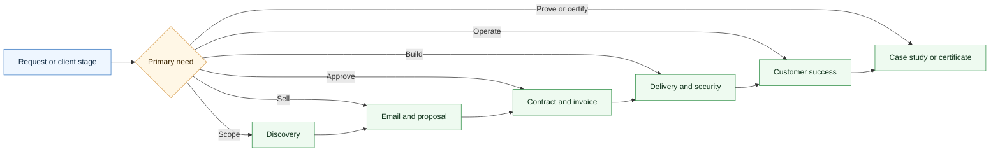

# Agentic Services Orchestrator Skill

A CompleteTech LLC Codex skill for routing multi-stage agentic services work across the specialist skill library.

## Workflow Diagram

## What It Does

- Chooses and sequences the right CompleteTech agentic specialist skill.
- Keeps specialist boundaries clear across discovery, email, proposal, contract, invoice, delivery, security review, customer success, proof, and certificate work.
- Preserves facts and open questions during handoff.
- Stops at approval gates before public use, legal commitment, invoice issuance, production launch, external communication, or proof publication.

## Contents

- `SKILL.md` - orchestration instructions, routing guide, boundary rules, and common multi-skill workflows.
- `agents/openai.yaml` - OpenAI agent metadata.

## Brand Notes

Use a direct, practical, low-hype tone. The orchestrator coordinates the lifecycle; it does not replace specialist templates or invent missing facts.
