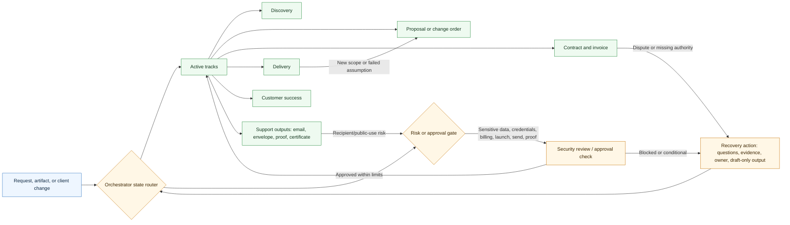
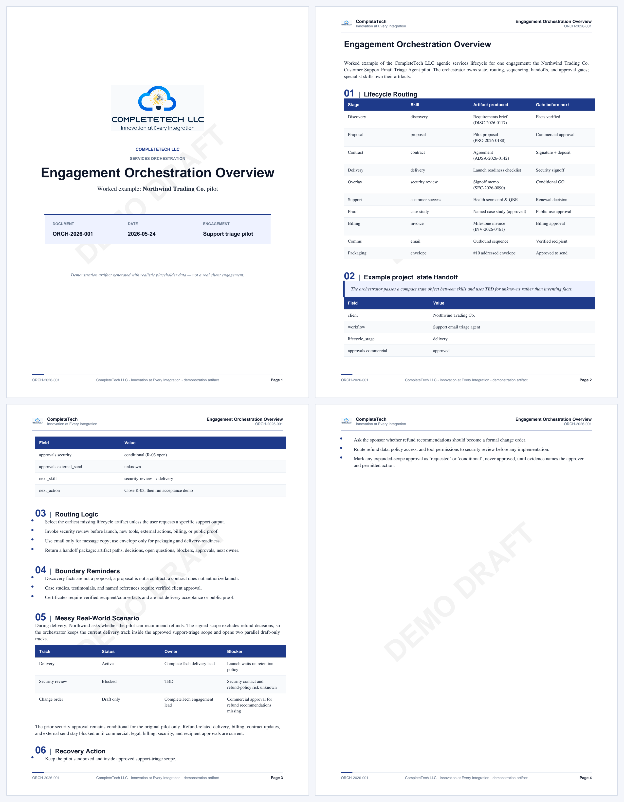

# Agentic Services Orchestrator Skill

<p align="center">
  
</p>

A CompleteTech LLC Codex skill for routing multi-stage agentic services work across the specialist skill library.

## About

Part of the CompleteTech LLC agentic services skill library. This skill coordinates lifecycle routing across specialist skills without replacing their templates, guardrails, or approval boundaries.

## OpenClaw / ClawHub Metadata

- Skill key: `agentic-services-orchestrator-skill`
- Version-ready metadata: `1.0.0`
- Homepage: https://github.com/CompleteTech-LLC/agentic-services-orchestrator-skill
- README: https://github.com/CompleteTech-LLC/agentic-services-orchestrator-skill#readme
- Runtime binaries: none
- Python packages: `reportlab>=4.0` (optional PNG preview: `pypdfium2`, `pillow`)
- Intended registry/discovery tags: `latest`, `complete-tech`, `codex-skill`, `agentic-development`, `agentic-workflows`, `orchestration`, `skill-routing`, `lifecycle`, `pdf`, `pdf-generator`
- License: repository code, templates, and documentation use MIT; ClawHub publishing is intentionally skipped for now.
- Brand assets: CompleteTech LLC names, logos, seals, and brand assets are reserved; see `BRAND_ASSETS.md`.

## Workflow Diagram



## What It Does

- Chooses and sequences the right CompleteTech agentic specialist skill.
- Keeps specialist boundaries clear across discovery, email, proposal, contract, invoice, delivery, security review, customer success, proof, and certificate work.
- Preserves facts and open questions during handoff.
- Stops at approval gates before public use, legal commitment, invoice issuance, production launch, external communication, or proof publication.

## Contents

- `SKILL.md` - orchestration instructions, routing guide, boundary rules, and common multi-skill workflows.
- `agents/openai.yaml` - OpenAI agent metadata.
- `scripts/render_pdf.py` - branded CompleteTech PDF generator (Markdown -> PDF + optional PNG preview).
- `requirements.txt` - Python dependencies for branded PDF rendering.

## Brand Notes

Use a direct, practical, low-hype tone. The orchestrator coordinates the lifecycle; it does not replace specialist templates or invent missing facts.

## Example



Full-document **branded PDF** rendered from the generated artifact: [example.pdf](assets/examples/example.pdf). Markdown source: [example.md](assets/examples/example.md).

**Orchestration overview: one engagement routed across the full skill library**

- Lifecycle routing table mapping each stage to its specialist skill and approval gate.
- Worked `project_state` handoff for the Northwind support-triage pilot.
- Routing logic, sequencing, and boundary reminders in one branded overview.

Generate the branded PDF (artifacts are delivered as PDFs, not raw Markdown):

```bash
pip install -r requirements.txt
python3 scripts/render_pdf.py --markdown assets/examples/example.md \
  --out assets/examples/example.pdf --png assets/examples/example.png \
  --logo assets/logo.png --title "Engagement Orchestration Overview" \
  --doc-type "SERVICES ORCHESTRATION" --subtitle "Worked example: <b>Northwind Trading Co.</b> pilot" --meta "DOCUMENT=ORCH-2026-001" --meta "DATE=2026-05-24" --meta "ENGAGEMENT=Support triage pilot"
```

## License

Code, templates, and documentation are licensed under the MIT License. CompleteTech LLC names, logos, seals, and brand assets are reserved and are not licensed for reuse except to identify this project. See `LICENSE` and `BRAND_ASSETS.md`.
